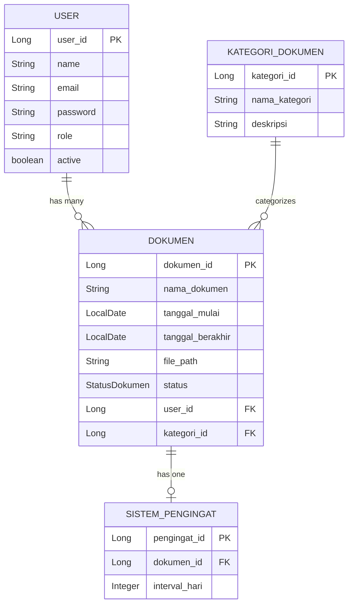

# Document Monitoring System - Guide Asistensi

## 📋 Overview
Aplikasi monitoring dokumen dengan integrasi AI (Gemini Vision) untuk ekstraksi data otomatis dan sistem pengingat kadaluarsa.

---

## 🏗️ Arsitektur Aplikasi

### **Technology Stack**
- **Backend**: Spring Boot 3.2.5, Java 17
- **Database**: PostgreSQL (production), H2 (development)
- **ORM**: Spring Data JPA + Hibernate
- **Security**: Spring Security
- **View**: Thymeleaf + Bootstrap
- **AI Integration**: Google Gemini Vision API
- **Email**: SMTP Gmail
- **Build Tool**: Maven

### **Layer Architecture**
```
┌─────────────────┐
│   Controllers   │ ← HTTP Request/Response
├─────────────────┤
│    Services     │ ← Business Logic
├─────────────────┤
│   Repositories  │ ← Data Access (JPA)
├─────────────────┤
│   Database      │ ← PostgreSQL
└─────────────────┘
```

### **Package Structure**
```
com.docmonitor/
├── controller/     # 4 controllers (Admin, Auth, Dashboard, Dokumen)
├── service/        # 7 services (business logic)
├── repository/     # 4 repositories (data access)
├── model/          # 5 entities (database tables)
├── dto/            # 3 DTOs (data transfer)
├── config/         # Security & web configuration
└── scheduler/      # 1 scheduler (automated tasks)
```

---

## 🗄️ Database Schema

### **Entity Relationships**


### **Status Dokumen Enum**
- **AKTIF** - Dokumen masih berlaku
- **AKAN_HABIS** - Akan kadaluarsa dalam 30 hari
- **KADALUARSA** - Sudah kadaluarsa

---

## 🚀 Fitur Utama

### **1. Autentikasi & Authorization**
- User registration & login
- Role-based access (ADMIN/USER)
- Spring Security integration

### **2. Document Management**
- **Manual Entry**: Form input data dokumen
- **AI Extraction**: Upload foto → Gemini Vision → Auto-extract data
- **File Upload**: Store dokumen files
- **CRUD Operations**: Create, Read, Update, Delete

### **3. AI Integration**
- **Gemini Vision API** untuk ekstraksi data dari gambar
- **Auto-categorization** berdasarkan hasil LLM
- **Confidence scoring** untuk hasil ekstraksi

### **4. Reminder System**
- **Automated scheduler** (jam 08:00 setiap hari)
- **Email notifications** untuk dokumen akan kadaluarsa
- **Manual trigger** via admin panel

### **5. Admin Features**
- **User management**: List & deactivate users
- **Category management**: Tambah/hapus kategori
- **Global statistics**: Dashboard admin
- **Manual scheduler**: Trigger pengingat

---

## 🔄 Flow Aplikasi

### **User Journey**
```
1. Register/Login → 2. Dashboard → 3. Upload Dokumen → 4. AI Extract → 5. View Results → 6. Get Notifications
```

### **AI Extraction Flow**
```
Upload Foto → Gemini API → Extract Data → Auto-Create Kategori → Save Dokumen → Create Pengingat
```

### **Scheduler Flow**
```
Trigger (08:00) → Check Status → Find Expiring → Send Email → Update Database
```

---

## 🛠️ Environment Setup

### **Prerequisites**
- Java 17+
- Maven 3.6+
- PostgreSQL 13+
- Git

### **Database Setup**
```sql
-- Create database
CREATE DATABASE document_monitoring_db;

-- Connection settings
URL: jdbc:postgresql://localhost:5432/document_monitoring_db
User: postgres
Password: root
```

### **Run Application**
```bash
# Clone repository
git clone <repository-url>
cd monitoringDokumen

# Run with Maven
mvnw.cmd spring-boot:run

# Access application
http://localhost:8081
```

---

## 📊 Demo Scenarios

### **Scenario 1: Manual Document Entry**
1. Register new user
2. Login → Dashboard
3. Tambah dokumen manual
4. Input nama, tanggal, kategori
5. Upload file (optional)
6. View result

### **Scenario 2: AI Document Extraction**
1. Login → Dashboard
2. Upload foto dokumen
3. System extracts data via Gemini Vision
4. Review extracted data
5. Auto-save dengan kategori
6. View created document

### **Scenario 3: Admin Operations**
1. Login as admin
2. View global statistics
3. Manage users & categories
4. Trigger manual scheduler
5. View system logs

---

## 🔍 Key Technical Points

### **JPA Configuration**
```properties
spring.jpa.hibernate.ddl-auto=update
spring.jpa.show-sql=true
spring.jpa.properties.hibernate.dialect=org.hibernate.dialect.PostgreSQLDialect
```

### **Security Configuration**
- Password encoding dengan BCrypt
- Role-based method security
- CSRF protection enabled

### **API Integration**
- Gemini Vision API untuk OCR
- SMTP Gmail untuk email
- HTTP client dengan OkHttp

### **File Management**
- Upload ke `./uploads/documents/`
- Multipart max size: 20MB
- File path stored in database

---

## ❓ Potential Questions & Answers

### **Technical Questions**
1. **Q: Kenapa pakai JPA bukan JDBC murni?**
   A: Productivity, automatic object mapping, less boilerplate code

2. **Q: Bagaimana AI integration bekerja?**
   A: Gemini Vision API extracts text → LLM processes → Structured data

3. **Q: Scheduler bagaimana diimplementasi?**
   A: Spring @Scheduled dengan cron expression, manual trigger via admin

### **Business Logic Questions**
1. **Q: Bagaimana sistem menentukan status dokumen?**
   A: Cek tanggal berakhir vs hari ini + warning days (30 hari)

2. **Q: Apa yang terjadi saat kategori tidak ada?**
   A: Auto-create kategori baru dengan deskripsi "Dibuat otomatis dari ekstraksi LLM"

3. **Q: Bagaimana email notification dikirim?**
   A: Scheduler check jam 08:00 → find expiring docs → send via SMTP Gmail

---

## 🚨 Common Issues & Solutions

### **Database Connection**
- Issue: Connection refused
- Solution: Check PostgreSQL service, credentials, firewall

### **AI API**
- Issue: Gemini API limit/error
- Solution: Check API key, rate limits, retry logic

### **File Upload**
- Issue: File too large
- Solution: Adjust multipart.max-file-size in properties

### **Email**
- Issue: Gmail authentication failed
- Solution: Enable 2FA, use app password, check SMTP settings

---

## 📝 Checklist Asistensi

### **Preparation**
- [ ] Application running successfully
- [ ] Database connected with sample data
- [ ] All major features tested
- [ ] Demo scenarios prepared
- [ ] Documentation ready

### **Demo Points**
- [ ] User registration & login
- [ ] Manual document entry
- [ ] AI extraction demo
- [ ] Admin panel features
- [ ] Email notification test
- [ ] Database schema explanation

### **Technical Discussion**
- [ ] Architecture explanation
- [ ] Design patterns used
- [ ] Security implementation
- [ ] Performance considerations
- [ ] Scalability aspects

---

## 📚 Additional Resources

### **Documentation**
- Spring Boot Documentation
- JPA/Hibernate Guide
- Gemini Vision API Docs
- PostgreSQL Documentation

### **Code Quality**
- Clean code principles
- SOLID design patterns
- Spring Boot best practices
- Database normalization

---

*Prepared for asistensi session - Document Monitoring System*
